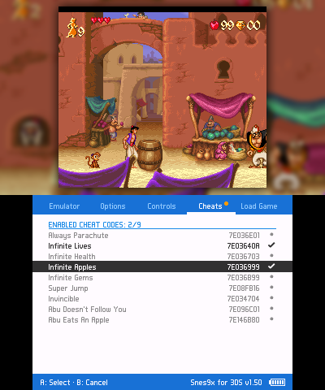
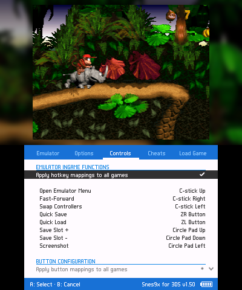
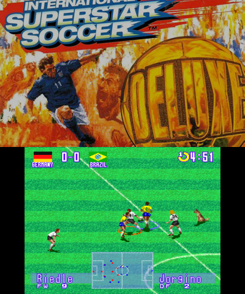

# Snes9x for 3DS

## Purpose:

This fork adds several features to bubble2k's great implementation, giving you more options to enjoy your game collection. It's built with recent versions of devkitARM (r62) and libctru (2.2.2). See [Building from source](#building-from-source)) for more info. Feedback and bug reports are welcome. Help with development is also welcome. 

## Main features:

* Game thumbnails (boxart, title, gameplay)
* Borders (Bezels) for each game
* Game cover for second screen
* Improved cheat menu
* Retroarch-ish folder structure to keep game collections clean
* Swap screen and more hotkey options
* ready to use and cleaned up [no-intro sets](https://github.com/matbo87/snes9x_3ds-assets) for cheats, thumbnails, borders and covers 

## Setup:

* Download latest cia version [here](https://github.com/matbo87/snes9x_3ds/releases) and install via [FBI](https://github.com/Steveice10/FBI/releases).
* (Optional) Download latest no-intro sets [here](https://github.com/matbo87/snes9x_3ds-assets/releases).

You can put your SNES games inside any folder. Keep in mind that zip files are not supported. Your game has to be in ".smc", ".sfc" or ".fig" format. 
Configs, saves and other assets are located at **sd:/3ds/snes9x3ds**

### 3dsx Version:
* Copy snes9x_3ds.3dsx and snes9x_3ds.sdmh to **sd:/3ds/snes9x_3ds**
* Go to your Homebrew Launcher and launch the snes9x_3ds emulator

## Images and cheats
See https://github.com/matbo87/snes9x_3ds-assets.

## Building from source
* Make sure you have devkitPro and ctrulib installed correctly. 
If not, https://devkitpro.org/wiki/devkitPro_pacman will guide you through this process.
* Makefile is based on TricksterGuy's [3ds-template](https://github.com/TricksterGuy/3ds-template). 
* Run `make 3dslink` to send the 3dsx build to your homebrew launcher.

You can use citra as well, but game emulation is broken (no sound + snes tiles are not rendered properly). This issue is several years old - probably since libctru 1.5.x.
I wasn't able to fix it - maybe you will be able to.

## Screenshots

  <figure style="width: calc(50% - 16px); max-width: 400px; margin: 16px 8px; flex: none">
    
    <figcaption>Pixel perfect video, cheats enabled</figcaption>
  </figure>
  <figure style="width: calc(50% - 16px); max-width: 400px; margin: 16px 8px; flex: none">
    
    <figcaption>TV style video, Applied Hotkeys + "Analog to Digital Type" disabled</figcaption>
  </figure>

  <figure style="width: calc(50% - 16px); max-width: 400px; margin: 16px 8px; flex: none">
    
    <figcaption>Cropped 4:3 video, game-specific cover</figcaption>
  </figure>
  <figure style="width: calc(50% - 16px); max-width: 400px; margin: 16px 8px; flex: none">
    
    <figcaption>4:3 Video, Swapped screen and konami cheat via 2-Player-Switch</figcaption>
  </figure>

## Frequently Asked Questions

### Game runs slow / looks wrong / has sound issues. What can I do?

There are some emulator options, which may improve gaming experience

* Go to emulator options tab and change the SRAM Auto-Save Delay to 60 seconds, or disable it entirely. There is also a SRAM-on-pause option.
* Go to emulator options tab and change the In-Frame Palette Changes to either one of the 3 options: Enabled, Disabled Style 1, Disabled Style 2. Color emulation is never perfect because we are using the 3DS GPU for rendering, which doesn't allow us to do what the SNES requires.
* Enabled cheats may also result in bad gaming experience. Disable them and reload the game
* Ensure that your game file isn't corrupt. Try another revision or region.
* Some games are just not running well on this emulator. (see [Compatibility List](http://wiki.gbatemp.net/wiki/Snes9x_for_3DS))

### Thumbnail caching is slow
Split up your game collection in sub folders. The more games you have in one single folder, the slower the caching.

### A lot of my games don't show any game preview
Make sure, game filename matches with image filename. For more information see https://github.com/matbo87/snes9x_3ds-assets

### Cheats are not working properly

The cheat set is roughly tested. So it is possible that some cheats will not work or even damage your savegame. Use them with caution.

### Can I use my save states generated from Windows versions of Snes9x?

You can try using save states from Snes9x v1.43, but sometimes this emulator doesn't recognize them.

## Snes core features
* Graphic modes 0 * 7.
* Frame skipping.
* Stretch to full screen / 4:3 ratio
* PAL (50fps) / NTSC (60 fps) frame rates.
* SDD1 chip (Street Fighter 2 Alpha, Star Ocean)
* SFX1/2 chip (Yoshi's Island, but slow on old 3DS)
* CX4 chip (Megaman X-2, Megaman X-3)
* DSP chips (Super Mario Kart)
* SA-1 chip (Super Mario RPG, Kirby Superstar)
* Sound emulation (at 32KHz, with echo and gaussian interpolation)

## What's missing / needs to be improved
* Citra SNES emulation is broken (probably since libctru 1.5.x?)
* Deprecated CSND service
* Minor sound emulation errors
* Poor performance in some SFX1/2 games like Doom
* Mosaics.
* In-frame palette changes - This is because this emulator uses the 3DS GPU for all graphic rendering. Without in-frame palette changes implemented, a small number of games experience colour issues.

## Credits

* bubble2k for his [snes9x_3ds emulator](https://github.com/bubble2k16/snes9x_3ds)
* ramzinouri for his [snes9x_3ds fork](https://github.com/ramzinouri/snes9x_3ds)
* Asdolo for his [snes9x_3ds forwarder](https://github.com/Asdolo/snes9x_3ds_forwarder)