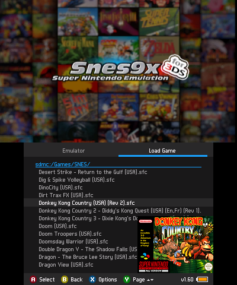
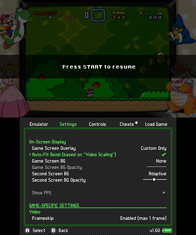
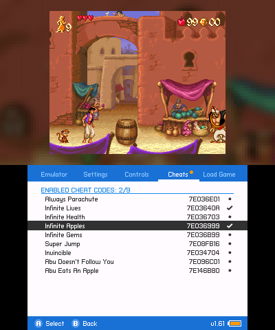
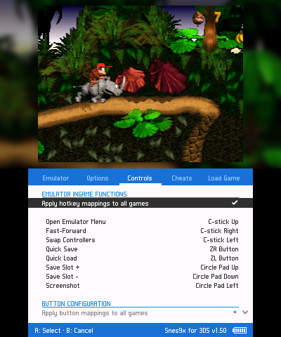
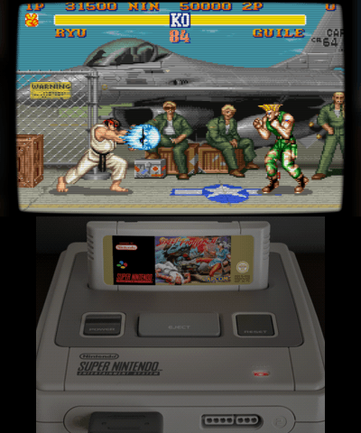
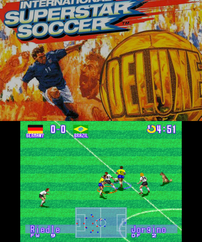

# Snes9x for 3DS — Stereoscopic 3D Fork

## What's Different in This Fork

This fork adds **real stereoscopic 3D** to SNES games on the Nintendo 3DS, in the style of M2's Sega 3D Classics series (3D Afterburner II, 3D Super Hang-On, etc.). The 3DS hardware slider controls depth intensity — slide it up and SNES background layers separate into genuine autostereoscopic 3D depth.

Based on [matbo87's excellent snes9x_3ds fork](https://github.com/matbo87/snes9x_3ds), which itself builds on bubble2k's original port.

### How It Works

SNES games naturally compose their scenes from up to 4 background layers (BG0-BG3) and a sprite layer. This fork renders each frame **twice** — once for the left eye, once for the right — with per-layer horizontal vertex offsets that create parallax depth:

- **Backgrounds recede into the screen** (hills, sky, distant scenery)
- **Sprites pop toward the viewer** (Mario, enemies, projectiles)
- **HUD stays at the screen plane** (score, lives, status bar)
- **3D slider at 0 = zero overhead** (identical to upstream mono build)

### Stereoscopic 3D Features

* Hardware 3D slider controls depth intensity in real-time
* 5 built-in depth profiles (Default, Action/Platform, RPG, Flat, Mode 0)
* Per-layer depth offsets tuned for common SNES layer usage patterns
* Color math and brightness effects (screen fades, transparency) work in stereo
* Mode 7 games auto-fallback to mono (F-Zero, Mario Kart — no crash)
* Fast path: slider at 0 = no performance cost, identical to mono

### Status

**Hardware validated on New Nintendo 3DS LL/XL** — stereoscopic depth effect confirmed working. This is an early release:

* Depth separation is clearly visible and slider-controllable
* Some visual artifacts at aggressive depth settings (layer edge bleed-through)
* Sub-screen renders mono (color math blending applied per-eye, but sub-screen geometry has no stereo offset)
* Performance target: 50-60 FPS on New 3DS with stereo enabled
* Old 3DS not yet tested, but based on the hardware math I HIGHLY doubt its got the juice to run.

### Try It

Download the `.3dsx` from [Releases](https://github.com/f4mrfaux/snes9x_3ds/releases), load a game, and slide the 3D slider up. Super Mario World and Donkey Kong Country are great first tests.

### Technical Documentation

* [DESIGN.md](DESIGN.md) — Full architecture, render pipeline, hardware checklist
* [FORK_NOTES.md](FORK_NOTES.md) — Research notes and key technical questions

---

## Upstream Features (from matbo87)

All features from the upstream fork are preserved:

* Game thumbnails (boxart, title, gameplay)
* Border (bezel) and second screen image (cover) for each game
* Themes
* Improved cheat menu
* RetroArch-ish folder structure to keep game collections clean
* Swap screen and more hotkey options
* ready to use and cleaned up [no-intro sets](https://github.com/matbo87/snes9x_3ds-assets) for cheats, thumbnails, borders and covers

## Setup:

* Download latest cia version [here](https://github.com/matbo87/snes9x_3ds/releases) and install via [FBI](https://github.com/Steveice10/FBI/releases).
* (Optional) Download latest no-intro sets [here](https://github.com/matbo87/snes9x_3ds-assets/releases).

You can put your SNES games inside any folder. Keep in mind that zip files are not supported. Your game has to be in ".smc", ".sfc" or ".fig" format. 
Configs, saves and other assets are located at **sd:/3ds/snes9x3ds**

### 3dsx Version:
* Copy snes9x_3ds.3dsx and snes9x_3ds.sdmh to **sd:/3ds/snes9x_3ds**
* Go to your Homebrew Launcher and launch the snes9x_3ds emulator

## Images and cheats
See https://github.com/matbo87/snes9x_3ds-assets.

## Building from source
* Make sure you have devkitPro and ctrulib installed correctly. 
If not, https://devkitpro.org/wiki/devkitPro_pacman will guide you through this process.
* Makefile is based on TricksterGuy's [3ds-template](https://github.com/TricksterGuy/3ds-template). 
* Run `make 3dslink` to send the 3dsx build to your homebrew launcher.

You can use citra as well, but game emulation is broken (no sound + snes tiles are not rendered properly). This issue is several years old - probably since libctru 1.5.x.
I wasn't able to fix it - maybe you will be able to.

## Screenshots

<table>
  <tr>
    <td width="50%" align="center"></td>
    <td width="50%" align="center"></td>
  </tr>
  <tr>
    <td valign="top" width="50%">Start screen, File menu tab with "Game Thumbnail" option enabled</td>
    <td valign="top" width="50%">Pause screen, Retroarch theme, game loaded</td>
  </tr>
  <tr><td colspan="2"></td></tr>
  <tr></tr>
  <tr>
    <td width="50%" align="center"></td>
    <td width="50%" align="center"></td>
  </tr>
  <tr>
    <td valign="top" width="50%">Original theme, Pixel perfect video, cheats enabled</td>
    <td valign="top" width="50%">TV style video, Applied Hotkeys + "Analog to Digital Type" disabled</td>
  </tr>
  <tr><td colspan="2"></td></tr>
  <tr></tr>
  <tr>
    <td width="50%" align="center"></td>
    <td width="50%" align="center"></td>
  </tr>
  <tr>
    <td valign="top" width="50%">Cropped 4:3 video, game-specific cover</td>
    <td valign="top" width="50%">4:3 Video, Swapped screen and konami cheat via 2-Player-Switch</td>
  </tr>
 </table>

## Frequently Asked Questions

### Game runs slow / looks wrong / has sound issues. What can I do?

There are some emulator options, which may improve gaming experience

* Go to emulator options tab and change the SRAM Auto-Save Delay to 60 seconds, or disable it entirely. There is also a SRAM-on-pause option.
* Go to emulator options tab and change the In-Frame Palette Changes to either one of the 3 options: Enabled, Disabled Style 1, Disabled Style 2. Color emulation is never perfect because we are using the 3DS GPU for rendering, which doesn't allow us to do what the SNES requires.
* Enabled cheats may also result in bad gaming experience. Disable them and reload the game
* Ensure that your game file isn't corrupt. Try another revision or region.
* Some games are just not running well on this emulator. (see [Compatibility List](http://wiki.gbatemp.net/wiki/Snes9x_for_3DS))

### Thumbnail caching is slow
Split up your game collection in sub folders. The more games you have in one single folder, the slower the caching.

### A lot of my games don't show any game preview
Make sure, game filename matches with image filename. For more information see https://github.com/matbo87/snes9x_3ds-assets

### Cheats are not working properly

The cheat set is roughly tested. So it is possible that some cheats will not work or even damage your savegame. Use them with caution.

### Can I use my save states generated from Windows versions of Snes9x?

You can try using save states from Snes9x v1.43, but sometimes this emulator doesn't recognize them.

## Snes core features
* Graphic modes 0 * 7.
* Frame skipping.
* Stretch to full screen / 4:3 ratio
* PAL (50fps) / NTSC (60 fps) frame rates.
* SDD1 chip (Street Fighter 2 Alpha, Star Ocean)
* SFX1/2 chip (Yoshi's Island, but slow on old 3DS)
* CX4 chip (Megaman X-2, Megaman X-3)
* DSP chips (Super Mario Kart)
* SA-1 chip (Super Mario RPG, Kirby Superstar)
* Sound emulation (at 32KHz, with echo and gaussian interpolation)

## What's missing / needs to be improved
* Citra SNES emulation is broken (probably since libctru 1.5.x?)
* Deprecated CSND service
* Minor sound emulation errors
* Poor performance in some SFX1/2 games like Doom
* Mosaics.
* In-frame palette changes - This is because this emulator uses the 3DS GPU for all graphic rendering. Without in-frame palette changes implemented, a small number of games experience colour issues.

## Credits

* bubble2k for his [snes9x_3ds emulator](https://github.com/bubble2k16/snes9x_3ds)
* matbo87 for his [snes9x_3ds fork](https://github.com/matbo87/snes9x_3ds) with thumbnails, themes, and UI improvements
* ramzinouri for his [snes9x_3ds fork](https://github.com/ramzinouri/snes9x_3ds)
* Asdolo for his [snes9x_3ds forwarder](https://github.com/Asdolo/snes9x_3ds_forwarder)
* M2 / Sega for the 3D Classics series that inspired the stereoscopic approach
* [Claude Code](https://claude.com/claude-code) for AI-assisted development of the stereoscopic 3D implementation
