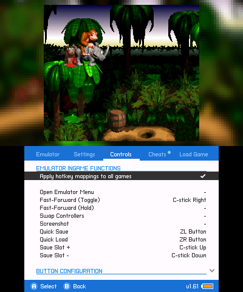
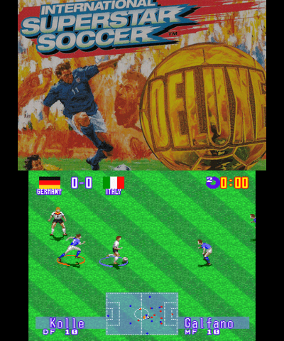
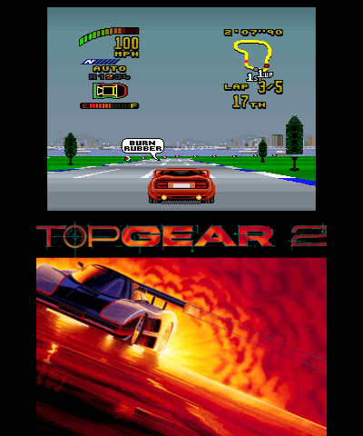
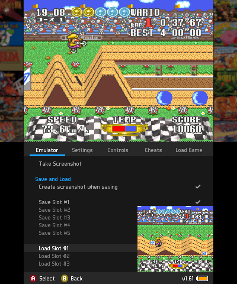

# Snes9x for 3DS

## Overview

This project is a fork of the legacy snes9x_3ds codebase by [bubble2k](https://github.com/bubble2k16/snes9x_3ds) and continues that work with a modernized architecture and improved user experience.
It builds with current devkitARM, libctru and citro3d releases (as of June 2026). Optional assets are available in the dedicated asset repository: [snes9x_3ds-assets](https://github.com/matbo87/snes9x_3ds-assets).

It works on all 2DS and 3DS models.
Old 2DS/3DS mainly struggle with Super FX and SA-1 games, but most SNES titles run well.

Feedback and bug reports are welcome.

## Main features

* Improved rendering for HDMA-heavy games and mosaic effects
* SNES refresh rate matching (60.1 Hz for NTSC, 50 Hz for PAL)
* NDSP audio output
* Rich visual customization with thumbnails, themes, per-game backgrounds and overlays
* Crop and overscan
* Improved cheat management
* Extended hotkey options and screen swap support
* Directory caching for faster ROM list loading

## Setup

* A modded 3DS is required.
* Install via [Universal Updater](https://universal-team.net/projects/universal-updater.html), or install the latest `.cia` from [Releases](https://github.com/matbo87/snes9x_3ds/releases)
* Optional: download asset packs from [snes9x_3ds-assets releases](https://github.com/matbo87/snes9x_3ds-assets/releases).

ROMs can be stored in any folder. ZIP files are not supported.

Supported ROM formats:
* `.smc`
* `.sfc`
* `.fig`
* `.bs`
* `.bsx`

Configs, saves and imported assets are stored in `sd:/3ds/snes9x_3ds`.

### 3DSX version

* Copy `snes9x_3ds.3dsx` to `sd:/3ds/snes9x_3ds`
* Start it from the Homebrew Launcher

## Assets (images and cheats)

Assets are provided in a dedicated asset repository:
* [matbo87/snes9x_3ds-assets](https://github.com/matbo87/snes9x_3ds-assets)

Notes:

* The repository follows a 1G1R-style selection.
* Naming is strict No-Intro style for matching.

## Building from source

* Install devkitPro and 3DS toolchain packages (including devkitARM, libctru, citro3d). If needed, follow the [devkitPro pacman guide](https://devkitpro.org/wiki/devkitPro_pacman).
* The Makefile is based on TricksterGuy's [3ds-template](https://github.com/TricksterGuy/3ds-template).

Required command-line tools in `PATH`:

* For `3dsx` builds: `tex3ds`, `smdhtool`, `3dsxtool` (from the devkitPro 3DS toolchain).
* For `cia` builds: `makerom` in addition to the above.

Common build targets:

* `make 3dsx`
* `make citra`
* `make 3dslink` (sends the `.3dsx` to your Homebrew Launcher)

This repository bundles `makerom` binaries under `makerom/` for convenience.
Bundled binary provenance is documented in `makerom/BINARY_SOURCES.md`.

### Emulator status

* Citra (nightly ≤ 2104): working
* Azahar: Mode7 1024x1024 texture renders as a solid yellow texture

## Development and Contributions

New work usually lands on `develop` first. Merges to `master` create build artifacts via GitHub Actions. Tagged GitHub [releases](https://github.com/matbo87/snes9x_3ds/releases) are the official stable releases.

Community PRs are welcome. For larger changes, a short issue first is appreciated.
Please keep PRs focused and test on hardware where possible.
AI-assisted code is fine, but contributors are responsible for understanding and validating the code they submit.
Broad, risky, hard-to-review PRs may be closed or split into smaller changes. Prototype work may still be credited if it informs a later implementation.

AI note: I use AI assistants as part of my development workflow, including code review, debugging, planning, implementation and documentation. All changes are reviewed and adjusted by me before they are merged.

## Screenshots

<table>
  <tr>
    <td width="50%" align="center"></td>
    <td width="50%" align="center"></td>
  </tr>
  <tr>
    <td valign="top" width="50%" align="center">Start screen, "Game Thumbnail" option enabled</td>
    <td valign="top" width="50%" align="center">Pause screen, per-game overlay enabled</td>
  </tr>
  <tr><td colspan="2"></td></tr>
  <tr></tr>
  <tr>
    <td width="50%" align="center"></td>
    <td width="50%" align="center"></td>
  </tr>
  <tr>
    <td valign="top" width="50%" align="center">Cropped top & bottom, cheats enabled</td>
    <td valign="top" width="50%" align="center">Applied hotkeys</td>
  </tr>
  <tr><td colspan="2"></td></tr>
  <tr></tr>
  <tr>
    <td width="50%" align="center"></td>
    <td width="50%" align="center"></td>
  </tr>
  <tr>
    <td valign="top" width="50%" align="center">Crop & overscan, scanlines enabled</td>
    <td valign="top" width="50%" align="center">Swapped screen</td>
 </tr>
 <tr>
    <td width="50%" align="center"></td>
    <td width="50%" align="center"></td>
  </tr>
  <tr>
    <td valign="top" width="50%" align="center">In-Frame Palette Changes enabled</td>
    <td valign="top" width="50%" align="center">BS-X game, savestate preview</td>
 </tr>
 </table>
  

## Frequently Asked Questions

### A game runs slow. How can I improve performance?

* Increase `Frameskips` (more than 2 isn't recommended)
* Set `Frame Sync Method` to `Sleep Sync`
* Set `In-Frame Palette Changes` to `Disabled Style 1` or `Disabled Style 2`
* Set `SRAM Auto-Save Delay` to 60 seconds or disable it (SD Card speed is slow on 3DS)
* Disable 3D and/or on-screen display settings

### A game looks or sounds wrong. What can I try?

* Set `In-Frame Palette Changes` to `Enabled`
* Increase `Audio Buffer Size` if audio crackles, skips or stutters
* Enabled cheats can break visuals or gameplay; disable cheats and reload the game
* Check if your ROM is valid (No-Intro is highly recommended; ROM hacks often have issues)
* Check the [known issues](KNOWN_ISSUES.md)

### Cheats are not working properly

* Cheat support is only lightly tested and some codes may not work correctly
* Use cheats with caution: broken codes can affect gameplay or damage save data

### Satellaview (BS-X) games

Satellaview games are supported, but compatibility is hit-or-miss.
See [Known Issues](KNOWN_ISSUES.md#satellaview-bs-x-games) for details and per-game status.

## License

Some files may carry their own license headers, but because this project includes the Snes9x core (`source/Snes9x/`), redistribution of the combined project follows the Snes9x non-commercial license terms.

See:
* [LICENSE.md](LICENSE.md)
* [THIRD_PARTY_NOTICES.md](THIRD_PARTY_NOTICES.md)

## Credits

* The Snes9x team for the SNES emulator core, and the libretro Snes9x core maintainers for ongoing reference work
* bubble2k, original author of [snes9x_3ds](https://github.com/bubble2k16/snes9x_3ds), for creating the excellent base this fork builds on
* Wyatt-James for his [snes9x_3ds fork](https://github.com/Wyatt-James/snes9x_3ds); this fork adapts a few safety, audio and stability fixes from his work
* ramzinouri's [snes9x_3ds fork](https://github.com/ramzinouri/snes9x_3ds) inspired the image border/background and theme support
* willjow's [snes9x_3ds fork](https://github.com/willjow/snes9x_3ds) revived the project after development had gone quiet
* The Citra/Azahar teams for making 3DS emulator testing and debugging practical
* Everyone reporting issues, testing games and suggesting improvements
